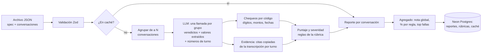

# Audibot

Servicio que audita automáticamente las conversaciones de un agente de IA contra una **rúbrica de reglas de negocio**. Cada regla de cada conversación recibe `passed` / `failed` / `not_applicable`, una **severidad** cuando falla (`minor` / `severe`), una **explicación breve** y **citas textuales** de la transcripción como evidencia. Además genera un reporte agregado: nota global, cumplimiento por regla y fallas más frecuentes.

La herramienta está pensada para consumirse como servicio, pero también a través de una interfaz sencilla en una URL desde donde personas no técnicas pueden generar nuevos reportes, rúbricas y ajustar algunos parámetros del funcionamiento. Fue concebida para funcionar multi-modelo, y así realizar las evaluaciones según sea conveniente en términos de costos y/o performance.

Construido para la prueba técnica de Forward Deployed Engineer de Vozy, sobre el caso de **Lina**, agente de cobranza por voz de Banco Andino (ficticio).

| | |
|---|---|
| **Servicio** | https://audibot.vercel.app |
| **API (Swagger)** | https://audibot.vercel.app/documentacion |
| **Especificación OpenAPI** | https://audibot.vercel.app/api/openapi.json |
| **`results.json`** | [`results.json`](./results.json) — las 20 conversaciones, generado por el servicio desplegado |
| **Hallazgos para el cliente** | [`HALLAZGOS.md`](./HALLAZGOS.md) |
| **Colección de Postman** | [`docs/audibot.postman_collection.json`](./docs/audibot.postman_collection.json) |

---

## Cómo probarlo

**Interfaz** (sin credenciales): en https://audibot.vercel.app → **Reportes → Nuevo reporte → "Usar archivo de ejemplo" → Evaluar**. El reporte muestra la nota global, el cumplimiento por regla, el top de fallas y el detalle por conversación con sus citas.

**API**: todas las llamadas requieren `Authorization: Bearer <API key>` (la key se entrega por correo).

```bash
curl -X POST "https://audibot.vercel.app/api/evaluate/batch" \
  -H "Authorization: Bearer $AUDIBOT_API_KEY" \
  -H "Content-Type: application/json" \
  --data-binary @conversaciones_prueba_fde.json
```

- **Swagger**: en `/documentacion`, *Authorize* → `POST /api/evaluate/batch` → *Try it out* → *Execute*. El cuerpo de ejemplo ya es el archivo de 20 conversaciones.
- **Postman**: importa la colección, pega la key en la variable `apiKey` y ejecuta las carpetas. Cada request trae tests automáticos con los criterios de entrega (33 aserciones: formato consistente, cita en cada falla, severidades, agregados, errores 400/401/404).

| Endpoint | Para qué |
|---|---|
| `POST /api/evaluate` | Evalúa **una** conversación (un ítem de `conversaciones`) |
| `POST /api/evaluate/batch` | Evalúa el **archivo completo** tal cual lo entrega el cliente (JSON o multipart). `?download=true` lo devuelve como `results.json` |
| `GET /api/models` | Modelos disponibles |
| `GET/POST /api/rubrics`, `GET/PUT/DELETE /api/rubrics/{name}` | Gestión de rúbricas |
| `POST /api/rubrics/generate` | Propone una rúbrica a partir de un archivo (no la guarda) |
| `GET/PATCH /api/settings` | Configuración: conversaciones por solicitud al LLM y citas en todos los criterios o solo en los que no cumplen |

Parámetros de evaluación (query): `rubric` (por defecto la predeterminada), `model` (por defecto `google/gemini-3.5-flash-lite`), `language` (`es` | `en`, por defecto `es`) y `fresh=true` para ignorar la caché.

---

## Arquitectura



- **Stack**: Next.js 16 (App Router) en Vercel, TypeScript, Zod 4, AI SDK 7 con proveedores intercambiables (Gemini por defecto, Claude opcional), Neon Postgres (plan gratuito) vía Drizzle.
- **Una sola fuente de verdad para el formato**: los esquemas Zod validan la entrada, validan la salida del LLM y generan la especificación OpenAPI que muestra Swagger. La documentación no puede desincronizarse del código.
- **API e interfaz comparten el mismo servicio** (`runBatchEvaluation`): cada evaluación por lote, venga de donde venga, queda guardada como reporte.

```
src/
  lib/
    schemas/      Zod: entrada (dataset), rúbrica, reporte, configuración
    llm/          judge.ts (prompt + salida estructurada), models.ts, retry.ts
    eval/         evaluate.ts (orquestación, grupos, caché), code-checks.ts, scoring.ts
    rubric/       banco-andino-01.ts (rúbrica diseñada), generate.ts (propuesta por LLM)
    db/           Drizzle: rubrics, reports, evaluation_cache, app_settings
  app/
    api/          endpoints REST
    reportes/ rubricas/ configuracion/ documentacion/   interfaz
scripts/          seed, evaluación local, generador de la colección de Postman
```

---

## La rúbrica

La rúbrica `Banco_Andino_01` divide las 10 reglas del cliente en **24 sub-reglas**, cada una con una sola conducta observable en una transcripción. Está guardada en base de datos y se puede editar o duplicar desde la interfaz (sección **Rúbricas**).

### Lógica de evaluación

- **Regla = conjunción de sus sub-reglas.** Una regla **cumple** si ninguna sub-regla falla y al menos una cumple; **no cumple** si alguna sub-regla falla; **no aplica** si ninguna sub-regla aplica.
- **"No aplica" explícito.** Las sub-reglas condicionales empiezan con "Si…" (p. ej. *"Si el cliente dice que ya pagó…"*). Si la situación no ocurre en la llamada, el resultado es `not_applicable`, **nunca** `passed`: así una regla que no se puso a prueba no infla el cumplimiento.
- **Severidad definida en la rúbrica, no por el LLM.** Cada sub-regla tiene severidad fija; la severidad de una regla fallida es la peor de sus sub-reglas fallidas. Es predecible, auditable y ajustable por el cliente sin tocar prompts.
- **Nota de la conversación** = reglas que cumplen / reglas que aplican × 100. La **nota global** es el promedio de las conversaciones.

### Criterios

| Regla | Sub-reglas (severidad) | Por qué |
|---|---|---|
| **R1** Presentación | Se presenta como Lina (leve) · se identifica como asistente virtual (leve) · menciona Banco Andino (leve) · **informa que se graba (grave)** | La grabación es un tema de consentimiento y protección de datos; el resto es protocolo |
| **R2** Verificación | Confirma el nombre del titular (leve) · **pide los 4 dígitos antes de revelar la deuda (grave)** · **los dígitos coinciden — código (grave)** · **no revela la deuda si no coinciden (grave)** | Es la cadena de seguridad: cualquier eslabón roto expone datos financieros |
| **R3** Terceros | **No revela monto, producto ni fechas (grave)** · pide horario para volver a llamar (leve) | Separar la fuga de datos (grave) de la omisión operativa (leve) |
| **R4** Datos de la deuda | **Monto exacto — código (grave)** · **fecha de vencimiento exacta — código (grave)** | Información financiera incorrecta genera reclamos y compromisos inválidos |
| **R5** Fecha de pago | Fecha concreta (leve) · **dentro de [llamada, llamada + 5 días] — código (grave)** | Una fecha fuera de ventana o retroactiva es un registro inválido |
| **R6** Negociación | **No ofrece descuentos/condonaciones/cuotas (grave)** · si los piden, registra y deriva (leve) | Ofrecer condiciones no autorizadas compromete al banco |
| **R7** Escalamiento | **Ante pedido de humano o disputa, transfiere o registra (grave)** | Ignorarlo es la causa típica de quejas formales |
| **R8** Ya pagó | Pide fecha y canal (leve) · informa las 48 h (leve) · **no insiste en un nuevo compromiso (grave)** | Presionar a quien ya pagó es el error con mayor impacto en experiencia |
| **R9** Cierre | Resume el resultado (leve) · se despide (leve). No aplica si el cliente cuelga o hay transferencia | Calidad de servicio |
| **R10** Tono | **Sin amenazas, cobro jurídico, embargos ni centrales de riesgo (grave)** · tono respetuoso, sin presionar (leve) | Las amenazas tienen exposición regulatoria; la presión, de experiencia |

### Casos límite decididos

| Caso | Decisión |
|---|---|
| Atiende un tercero (C03, C04) | R3 aplica; R4 no aplica (los datos se evalúan solo cuando se informan al titular). R2 solo evalúa la confirmación de nombre |
| Nunca pidió los dígitos (C02, C19) | Falla R2.2; R2.3 no aplica (no hay dígitos que comparar), sin doble penalización |
| El cliente cuelga (C07) | R9 no aplica: el agente no tuvo oportunidad de cerrar |
| "Voy a ir al banco a reclamar" (C09) | Es un reclamo: R7 aplica y falla |
| "¿Tanto? Pensé que era menos" (C11) | Sorpresa, no disputa: R7 no aplica. La falla real es R4 (monto mal informado) |
| Cliente pide registrar una fecha pasada (C17) | R5 falla como grave: el agente no debe aceptar un registro retroactivo |

### Rúbricas nuevas

Desde **Rúbricas → Nueva rúbrica** se puede partir de un archivo (se leen las reglas `R1…Rn` y el LLM propone sub-reglas, severidad y método) o en blanco. La propuesta es un borrador: el diseño final lo valida una persona. En la prueba, la propuesta automática omitió, por ejemplo, el caso en que el agente **ofrece** un descuento sin que se lo pidan (C05), algo que la rúbrica diseñada sí captura.

---

## Qué resuelve el código y qué resuelve el LLM

Regla general: **el LLM interpreta lenguaje; el código compara y decide.**

| Tarea | Quién | Por qué |
|---|---|---|
| Entender tono, intención, si algo se dijo o se omitió | LLM | Requiere interpretación del lenguaje natural |
| Convertir "dos millones seiscientos veinte mil" → `2620000`, "uno, tres, cinco, dos" → `1352`, "el sábado 26" → `2026-09-26` | LLM (extracción) | Normalización del habla, frágil con reglas |
| Comparar dígitos, montos y fechas contra `datos_cliente`; validar la ventana de 5 días | **Código** | Exacto y determinista. Los LLM fallan en comparaciones sutiles (C20: `6295` vs `6259`) |
| Citas de evidencia | **Código** | El LLM solo cita **números de turno**; el texto se copia de la transcripción. La evidencia no puede inventarse |
| Severidad, combinación de sub-reglas, puntajes, agregados | **Código** | Reglas de negocio predecibles y configurables |
| Validar la respuesta del LLM | **Código** (Zod) | Una respuesta sin todas las sub-reglas, o una falla sin cita, se rechaza y se reintenta |

---

## Decisiones técnicas

- **Una llamada al LLM por grupo de conversaciones.** La salida es una lista de respuestas etiquetadas por sub-regla (salida estructurada con un esquema de tamaño fijo, que todos los proveedores aceptan); el código verifica que estén todas las sub-reglas de todas las conversaciones y, si falta alguna o una falla no cita evidencia, reintenta explicándole al modelo qué corregir. El tamaño del grupo es configurable (**Configuración**, por defecto 5): agrupar no ahorra tokens, ahorra **solicitudes**, que es lo que limita el tier gratuito. Si una llamada agrupada falla, sus conversaciones se reintentan de a una.
- **Caché de evaluaciones.** El resultado se guarda con un hash de (conversación, contenido de la rúbrica, modelo, idioma, versión del prompt). Re-evaluar el mismo archivo es instantáneo y gratis; editar la rúbrica o el prompt invalida la caché automáticamente. `fresh=true` la ignora.
- **Manejo de errores.** Reintentos que respetan el tiempo que pide el proveedor (*"retry in 22s"*); si la cuota diaria se agotó, falla rápido con un mensaje claro en lugar de esperar horas. Si el LLM no responde o responde mal, esa conversación vuelve con `status: "error"` y el resto del lote continúa. Toda respuesta de error es JSON (`{ error, details? }`); el servicio nunca devuelve un 500 sin manejar.
- **Agnóstico de proveedor.** El modelo es un parámetro (`model`); agregar un proveedor es una línea en el registro de modelos. Gemini es el predeterminado porque tiene tier gratuito. También está conectado a Claude con un pequeño saldo de mi cuenta personal.
- **Seguridad.** La API exige una API key (`Bearer`), comparada en tiempo constante; si no hay keys configuradas, rechaza todo (falla cerrada). Las keys viven en variables de entorno de Vercel.
- **Rúbricas en base de datos.** Se pueden tener varias rúbricas por cliente o bot (convención de nombre `Cliente_Bot_NN`) y una predeterminada.

---

## Precisión

Las 20 conversaciones se etiquetaron a mano ([`data/expected-failures.json`](./data/expected-failures.json): qué reglas no cumple cada una, con el motivo) y un script compara cualquier `results.json` contra ese etiquetado a nivel de regla:

```bash
node scripts/score-accuracy.mjs results.json
```

**Precisión** = de las fallas reportadas, cuántas son reales (falsos positivos). **Recall** = de las 21 fallas reales, cuántas se detectaron.

| Modelo (grupos de 5) | Precisión | Recall | Conversaciones exactas | Duración del lote |
|---|---|---|---|---|
| Gemini 3.5 Flash-Lite (predeterminado) | 91–100 % | **100 %** | 18–20 / 20 | 2–5 min |
| Claude Haiku 4.5 | 91,3 % | **100 %** | 18 / 20 | ~1,7 min |
| Claude Sonnet 5.5 | 95,5 % | **100 %** | 19 / 20 | ~1,7 min |

- **Ningún modelo omitió una falla real**, incluidas las sutiles: dígitos invertidos (C20), monto mal informado (C11), fecha de vencimiento errada (C19), fecha de pago fuera de ventana o retroactiva (C10, C17), dígitos dichos en palabras (C15, correctamente cumple).
- **Las diferencias son falsos positivos en casos límite**, por ejemplo marcar R8 ("ya pagó") cuando el cliente pidió registrar una fecha pasada (C17). Flash-Lite varía entre ejecuciones (rango en la tabla); la caché fija el resultado una vez obtenido.
- **Cómo se usó para mejorar el prompt**: una ejecución mostró que el modelo "corregía" el monto dicho (2.620.000) con el de los datos del cliente (2.260.000), ocultando justo la discrepancia que se audita. Se agregó la instrucción de citar literalmente lo dicho antes de convertirlo y de no tomar valores de los datos del cliente; el caso volvió a detectarse.

El etiquetado es de una sola persona y a nivel de regla; el siguiente paso sería etiquetar por sub-regla y con un segundo revisor.

---

## Costo estimado de evaluar 1.000 conversaciones

Uso medido en llamadas reales con la rúbrica `Banco_Andino_01` (24 sub-reglas), grupos de 5:

| Modelo | Tokens por conversación (entrada / salida) | Precio por 1 M (entrada / salida) | **1.000 conversaciones** |
|---|---|---|---|
| **Gemini 3.5 Flash-Lite** (predeterminado) | ~750 / ~1.700 | $0,30 / $2,50 | **≈ US$ 4,50** — o **US$ 0** en tier gratuito |
| Gemini 3.5 Flash | ~750 / ~1.700 (estimado) | $1,50 / $9,00 | ≈ US$ 16,50 |
| Claude Haiku 4.5 | ~1.200 / ~1.350 | $1,00 / $5,00 | ≈ US$ 8 |
| Claude Sonnet 5.5 | ~1.350 / ~1.500 | $2,00 / $10,00 | ≈ US$ 18 |

- El costo lo domina la **salida** (razonamiento y explicación por sub-regla), no la transcripción. Explicaciones más cortas o evaluar solo reglas aplicables serían los primeros lugares donde miraría para poder bajar costos.
- Al principio se pedía una justificación incluso para las reglas pasadas; lo pusimos como un parámetro configurable para ahorrar.
- **En tier gratuito el costo es US$ 0**, limitado por solicitudes diarias: con grupos de 5, 1.000 conversaciones son ~200 solicitudes.
- **Re-evaluaciones del mismo contenido cuestan US$ 0** (caché).
- Infraestructura: Vercel Hobby y Neon Free, US$ 0.
- Agrupar no reduce tokens de forma relevante; reduce **solicitudes**, que es lo que limita el tier gratuito. Un esquema de salida compacto (lista de respuestas en lugar de una propiedad por sub-regla) bajó la entrada de ~2.400 a ~750 tokens por conversación.

---

## Limitaciones conocidas

- **La interfaz no tiene autenticación.** La API exige key, pero la interfaz es pública para que el evaluador pueda probarla sin pasos manuales; cualquiera con la URL puede crear reportes, editar rúbricas o cambiar la configuración. En producción iría detrás de SSO.
- **Cuotas del tier gratuito.** `gemini-3.5-flash` tiene solo ~20 solicitudes/día; por eso el predeterminado es Flash-Lite. Un lote sin caché tarda ~2–5 min y Flash-Lite varía entre ejecuciones en casos límite.
- **Límite de 300 s por función en Vercel.** Lotes de hasta 50 conversaciones por solicitud; para volúmenes mayores habría que pasar a procesamiento en cola (p. ej. Vercel Queues) con reporte asíncrono.
- **No determinismo del LLM.** Las mismas entradas pueden variar en casos límite; la caché fija el resultado una vez obtenido y los chequeos críticos (datos, fechas) son por código.
- **El etiquetado de precisión es de una sola persona** y a nivel de regla (ver *Precisión*).
- **La propuesta automática de rúbricas** es un punto de partida: requiere revisión humana.

---

## Correrlo localmente

Requisitos: Node 20+ y una base Postgres (Neon gratis sirve).

```bash
git clone https://github.com/alvarocasas33/audibot && cd audibot
npm install
cp .env.example .env.local      # completar las variables
npm run db:push                 # crea las tablas
npm run db:seed                 # carga la rúbrica Banco_Andino_01
npm run dev                     # http://localhost:3000
```

| Variable | Uso |
|---|---|
| `DATABASE_URL` | Postgres (Neon) |
| `GOOGLE_GENERATIVE_AI_API_KEY` | Gemini (tier gratuito en https://aistudio.google.com/apikey) |
| `ANTHROPIC_API_KEY` | Opcional, habilita Claude |
| `AUDIBOT_API_KEYS` | Keys aceptadas por la API, separadas por coma |
| `EVAL_CONCURRENCY` | Opcional, solicitudes simultáneas al LLM (por defecto 4) |

Otros comandos:

```bash
npm test                        # tests unitarios (chequeos por código, puntajes, auth, reintentos)
npm run evaluate -- data/conversaciones_prueba_fde.json --out results.local.json
                                # evaluación local sin HTTP (opciones: --ids, --model, --rubric, --language, --per-request, --fresh)
node scripts/build-postman.mjs  # regenera la colección de Postman
```
